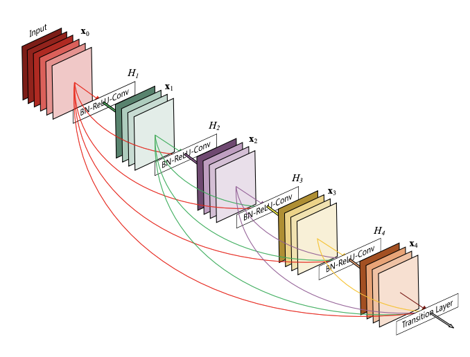
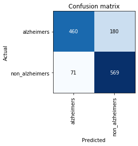

# Alzheimers Detection using MRI Scans 🏥

## Getting Started

```bash
git clone <url>
cd alzheimers-fastai
tar -xf dataset.tar.xz
pip install -r requirements.txt
python alzheimers_pred.py
```

#### Use `data.tar.xz` only if using 5-Fold-Cross-Validation

> OR

[](https://github.com/RyanDsilva/alzheimers-detection/blob/master/Alzheimers_Pred.ipynb)

> OR

#### Use the pretrained model from `models/alzheimers.pt`

## Approach 📑

- Use of OASIS dataset considering the three scan angles as individual truth thus expanding the dataset by 3x.
- Transfer Learning on DenseNet201
- Trained for 5+25 epochs

> More `epochs`, `data_transforms` may improve results.



## Results ✨

- Accuracy of ~ 81%.

### Confusion Matrix:


