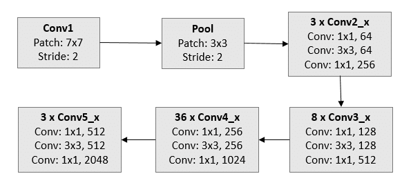

# Alzheimers Detection using MRI Scans 🏥

## Getting Started

```bash
git clone <url>
cd alzheimers-fastai
tar -xf dataset.tar.xz
pip install -r requirements.txt
python alzheimers_pred.py
```

##### Use `data.tar.xz` only if using 5-Fold-Cross-Validation

> OR

[](https://colab.research.google.com/github/weiji14/deepbedmap/]

> OR

### Use the pretrained model from `models/alzheimers.pkl`

## Approach 📑

- Use of OASIS dataset considering the three scan angles as individual truth thus expanding the dataset by 3x.
- Transfer Learning on Resnet152
- Trained for 5+10 epochs



## Results ✨

### Accuracy of **~ 80%**.

### Confusion Matrix:


